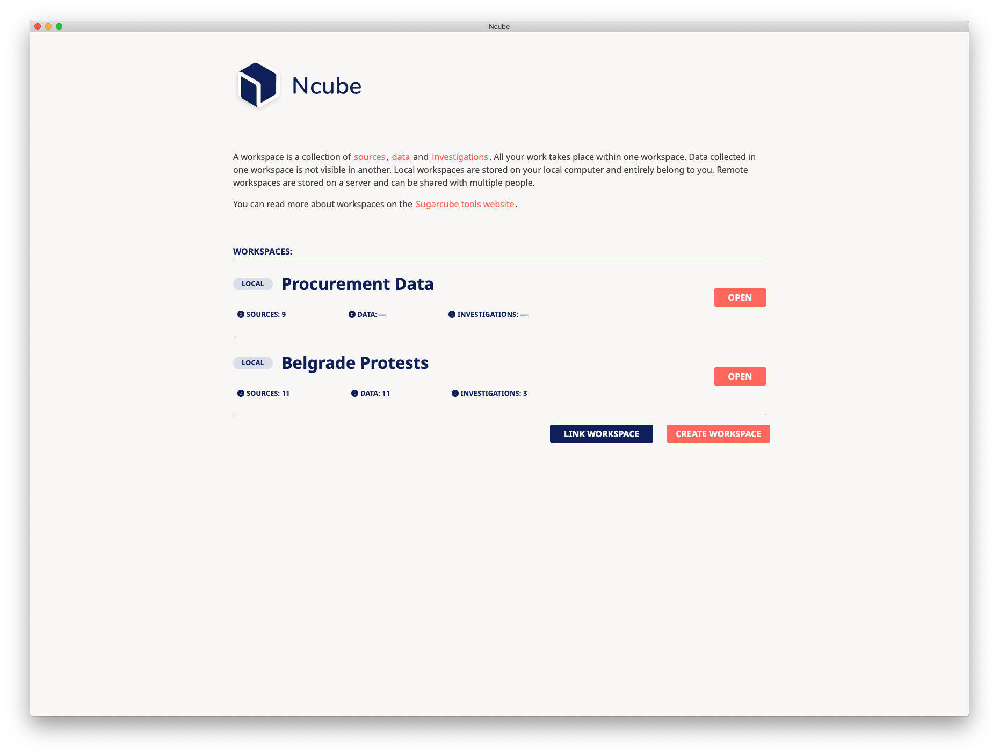
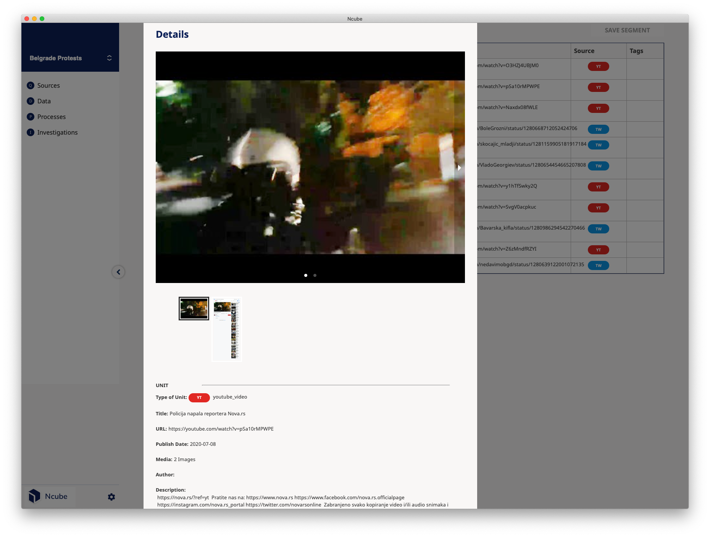
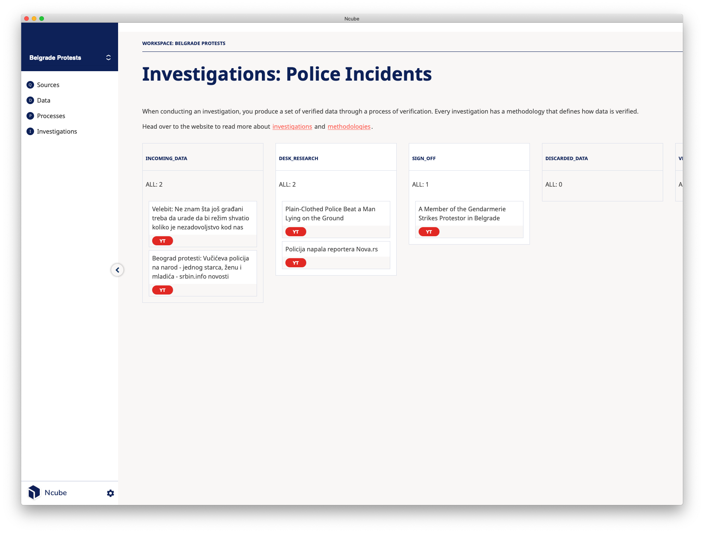

import NcubeSponsors from "../../src/components/ncube-sponsors";

# Ncube

Data is an integral part of modern society. Data Investigation has gained ground and has become an essential aspect of the daily work of human rights researchers.

Using tools like [Sugarcube](/sugarcube) organizations like [Syrian Archive](https://syrianarchive.org) can document human rights violations committed in the ongoing war in Syria. They successfully collected to this date over 3.5 million videos, images and testimonies from platforms such as Facebook, Twitter and Youtube, creating one of the most significant collections of documentation about the war in Syria.

Based on our past work on Sugarcube, we developed [Ncube](/ncube), a tool to turn quantitative data into qualitative data.

While there are other tools in the same field each one of them focuses on a slightly different aspect of data investigation. Ncube filled in some blanks that were not covered by those tools and tried to be a more comprehensive tool. For Syrian Archive, Ncube will substitute a lot of the manual work for their verification processes. But we decided to go further than the requirements of Syrian Archive. Interviews with investigative journalists and other researchers heavily informed the design phase. We believe Ncube will become a valuable tool to organize data sources, share rich data and enhance the fact-checking process that goes beyond the immediate needs of Syrian Archive.

Ncube is a graphical desktop and cross-platform application that allows human rights investigators and other researchers to **preserve**, **explore** and **verify** data. We diverged from the current trend to build every application as a web-based application. Instead, to emphasize user ownership, we designed Ncube to be _local-first software_. This direction improves the security, privacy, long-term preservation, and user control of data. While Ncube itself is a desktop application, it can connect to remote workspaces hosted on a central server to enable collaboration. More decentralized, peer-to-peer forms of cooperation will be possible in future versions of Ncube.

### Preservation

Ncube provides a user interface to run Sugarcube data processes. It unifies different types and sources of data (e.g. Tweets, websites, uploads) into a shared format, and preserves text, images and videos. The data is retained by collecting and enhancing regular data to increase its forensic validity. This process allows the systematic monitoring of a wide range of data sources. Experiences at Syrian Archive show that online data tends to disappear. Therefore, Ncube makes an offline copy of any data it collects.

### Exploration

Ncube provides access to the collected data using a search system. Ncube utilizes search operators based on Boolean logic as it's the primary interface to exploring the database. Search results can further be filtered based on meta-data and tags. Relevant searches can be saved for quick access later on.

### Verification

Developing a suitable methodology is an essential aspect of every data investigation. In Ncube, a data methodology consists of

- a verification process, i.e. the stages of verification each piece of data has to pass through,
- and an annotation schema describing additional insights about some data.

Ncube prioritizes the ability to represent diverse verification processes and annotation schemes. Investigators should not have to compromise their methodology to accommodate the tool they are using..

Once a methodology is defined, Ncube allows to apply it in a systematic and structured fashion on lots of individual pieces of data. The outcome of this process is a set of verified data.

## To cube or not to cube

Arguably browsers are one of the most important research tools that investigators use every day. To reduce friction for the day-to-day work of investigators, Ncube has an accompanying browser extension for source discovery. While browsing the web investigators can send URL's of interest to Ncube with the click of one button without having to leave the browser environment.

All the features of Ncube have one purpose: _produce a set of verified data_. Investigators have to be confident enough about their data to make claims and statements around a given event. These claims are stated in reports, articles and court cases and therefore have to be able to stand scrutiny. Verification is an essential tool in a post-truth world. It allows us to develop compelling stories which expose the
misuse of power and human rights abuses.

Ncube's features around the preservation, exploration and verification of data all serve this single goal.

## The non-scalable project

Introducing data-based processes into existing human rights work can be challenging. Investigators face a myriad of data-related tools and have to choose between different features and tradeoffs, It's overwhelming. Traditionally, recommendations for such tools were primarily expressed based on the circumstances of their licensing. I believe that we have to find different categories on which we base recommendations for tools and technologies.

Most tools and technologies these days are designed to "scale up". In the technological world, scalability is defined as the ability to expand a project without having to change its organization or framing assumptions. Scalability requires that project elements are oblivious to the indeterminacies of encounters. In order to expand, the project has to ignore new relations as they are added. A scalable research project, for example, admits only data that already fits the research frame. Similarly, a scalable tool does not change its mode of operation when in use.

However, the human rights field is organized as open-ended gatherings that build a multilayered network. Adding new relations is vital for the success and collaboration between different actors in the field. If the tools we use cannot transform themselves, we severely limit our possibilities. Thus scalability prevents meaningful diversity; that is, a diversity that could change things.

When we build tools, we should always place the community that we make those tools for the centre in our design. Far too often do we fall into a trap to build tools for the sake of technology. It is easy to forget about the implications, and tradeoffs tools can impose on their users. Tool builders far too often favour scalability and the choice of technology stacks over values such as flexibility, reusability and situating a tool in a broader social context.

## Final words

Starting from different case studies, we observed different heuristics when investigators use data as part of their investigative toolbox. The features of Ncube were chosen based on this analysis. We wanted to allow great flexibility to define suiting data methodologies so that Ncube is applicable for a wide variety of data investigations. Further, we wanted Ncube to fit into various positions of the social context of investigators and their networks, allowing multiple forms of cooperation. Tools should adapt themselves around people and not the other way around.

To learn how to use Ncube for your data investigations, head over to the [Get Started Guide](/ncube/get-started). To get help about Ncube and data investigation methodologies, or to suggest new use cases and functionality, feel free to post on the [Sugarcube Tools community forum](https://users.sugarcubetools.net). Ncube is an imperfect software in an imperfect world. If you found that something wasn't working the way you expected it, please report it on the [Ncube issue tracker](https://github.com/critocrito/ncube/issues).

<NcubeSponsors />
