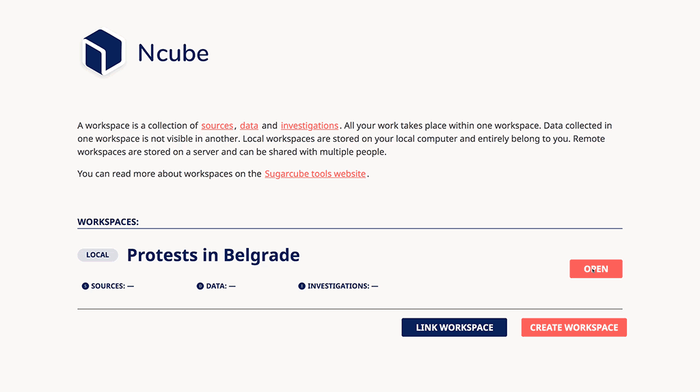
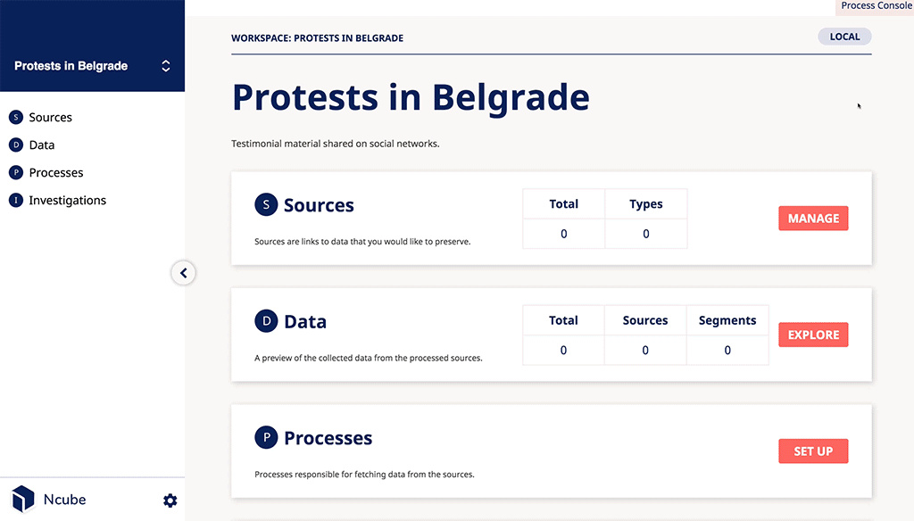

import Synopsis from "../../src/components/synopsis";
import Warning from "../../src/components/warning";
import Note from "../../src/components/note";

<Synopsis>
<li>This tutorial takes you from configuring Ncube right through to preserving, exploring and verifying data.</li>
</Synopsis>

# Tutorial

Ncube is meant to fulfill the need of researchers and investigative journalists that work with the preservation of digital content as a form of testimonial validated data.

In this tutorial you will we will be recreating this research https://balkaninsight.com/2020/07/10/serbian-protests-police-brutality-mapped/, following the hypothesis that on the same day of the incidents a journalist wanted to collect the available information that was being published around the web so she could report further on.

With Ncube you will be able to:

- Create your workspace
- Manage Sources
- Set up available process
- Explore the database
- Verify data

Keep in mind that Ncube is an unfinished software in an imperfect world. To get help about Ncube and data investigation methodologies, or to suggest new use cases and functionality, feel free to reach out on the [Sugarcube Tools community forum](https://users.sugarcubetools.net).

## Creating a workspace

A workspace is a collection of sources, data units and investigation methodologies. A workspace can be either local or remote. The latter lives on a server to which you can connect, while the former exists on your computer. For this tutorial, we will use a local workspace. A local workspace includes a database that is entirely owned by you. Data stored in this workspace is not visible in another workspace.

To show you different functionalities of ncube we will try to replicate the following research https://balkaninsight.com/2020/07/10/serbian-protests-police-brutality-mapped/.

We start by clicking on Create Workspace. The Title for the workspace will be "Protests in Belgrade", and we give it a short description "Testimonial material shared on social networks".

For this tutorial, you will require an internet connection. Depending on your computer and Internet speed, creating a workspace can take some time. Once the process completes, the OPEN button will be activated.

## Workspace dashboard

When you open your workspace, you see the dashboard. It is the central space of Ncube. In it, you see a summary of the different features available in this workspace.

## Sources

Sources are a list of links, or URLs, of the data that you would like to preserve. Those can be, e.g. a Youtube video or a Tweet. You can enter links manually or use the Discovery web extension.

Click on `Add Source` to create a new source. The term of a source is the URL of the data you want to preserve. The type of source tells Ncube how to do the preservation. Source tags can help you to organize and group the data that is preserved.

Let's create our first source. Fill in the following information.

Enter the Term: `https://youtu.be/y1hTfSwky2Q`

Select Source type: `youtube_video`

We create a tag that we name `Police Brutality`.

