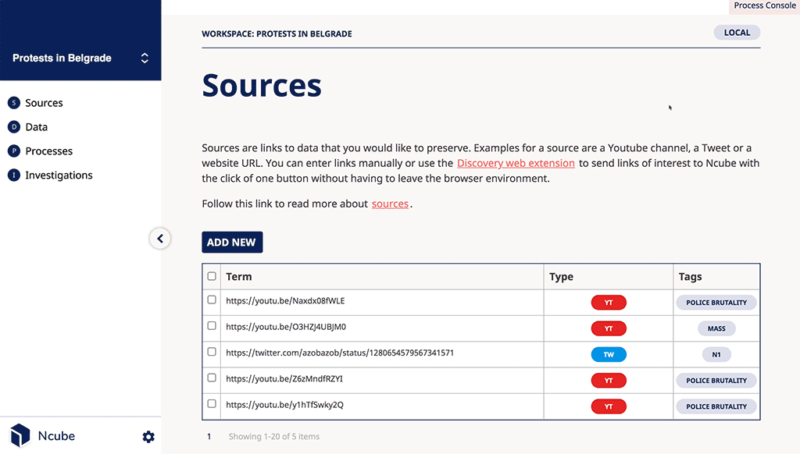
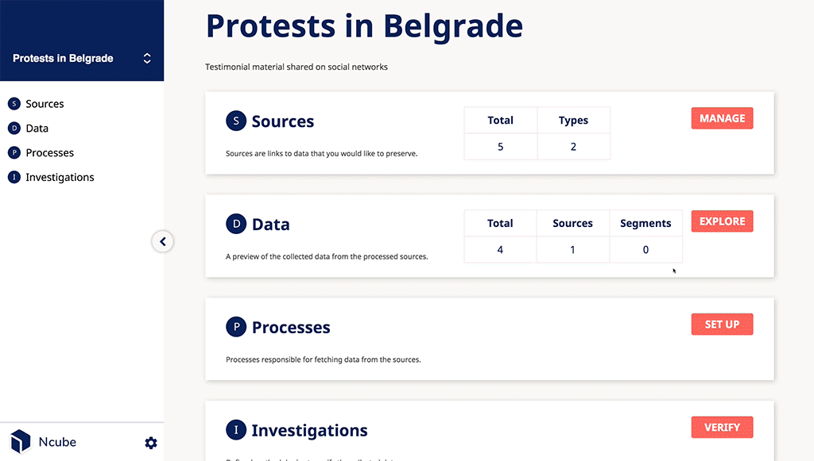
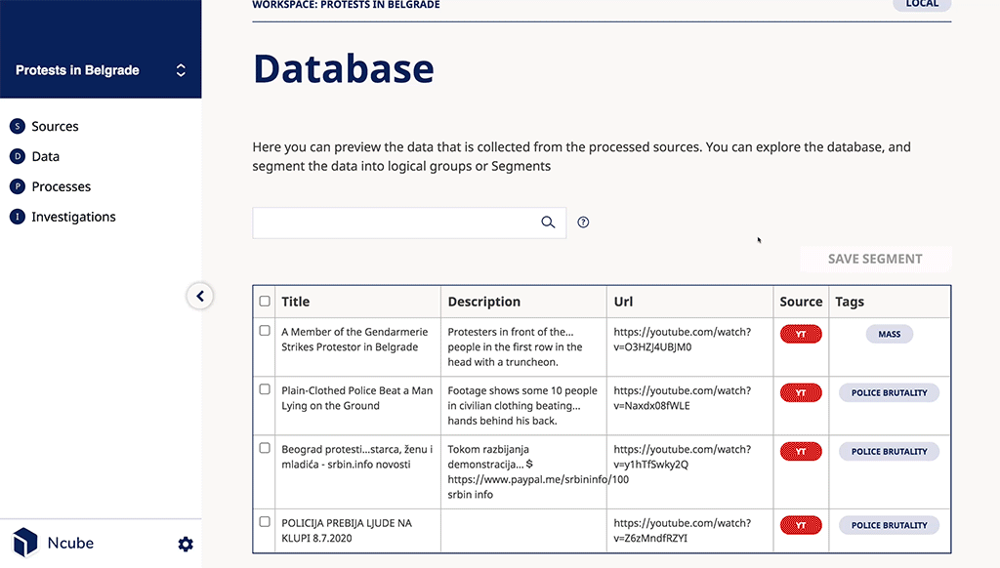

import Synopsis from "../../src/components/synopsis";
import Warning from "../../src/components/warning";
import Note from "../../src/components/note";

<Synopsis>
<li>This tutorial will help you to get started with Ncube and showcase the main features.</li>
</Synopsis>

# Tutorial

Ncube is meant to fulfil the need of researchers, and investigative journalists that work with the preservation of digital content as a form of testimonial validated data.

To show you different functionalities of ncube we will try to replicate the following research https://balkaninsight.com/2020/07/10/serbian-protests-police-brutality-mapped/.

With Ncube you will be able to:

- Create your workspace
- Manage Sources
- Set up available process
- Explore the database
- Verify data

Keep in mind that Ncube is an unfinished software in an imperfect world. To get help about Ncube and data investigation methodologies, or to suggest new use cases and functionality, feel free to reach out on the [Sugarcube Tools community forum](https://users.sugarcubetools.net).

## Creating a workspace

A workspace is a collection of sources, data units and investigation methodologies. A workspace can be either local or remote. The latter lives on a server to which you can connect, while the former exists on your computer. For this tutorial, we will use a local workspace. A local workspace includes a database that is entirely owned by you. Data stored in this workspace is not visible in another workspace.

We start by clicking on Create Workspace. The Title for the workspace will be "Protests in Belgrade", and we give it a short description "Testimonial material shared on social networks".

For this tutorial, you will require an internet connection. Depending on your computer and Internet speed, creating a workspace can take some time. Once the process completes, the OPEN button will be activated.

## Workspace dashboard

When you open your workspace, you see the dashboard. It is the central space of Ncube. In it, you see a summary of the different features available in this workspace.

## Sources

Sources are a list of links, or URLs, of the data that you would like to preserve. Those can be, e.g. a Youtube video or a Tweet. You can enter links manually or use the Discovery web extension.

Click on `Add Source` to create a new source. The term of a source is the URL of the data you want to preserve. The type of source tells Ncube how to do the preservation. Source tags can help you to organize and group the data that is preserved.

Let's create our first source. Fill in the following information.

Enter the Term: `https://youtu.be/y1hTfSwky2Q`

Select Source type: `youtube_video`

We create a tag that we name `Police Brutality`.

## Data preservation

After you added one or several sources, you can move on to preserving the data in those links.

We use data processes to fetch and download any sources. A process looks up the term of a source and based on its type, fetches any data that is associated with it; this includes images, videos and screenshots. Ncube currently provides four prepared processes, but we will likely add more in the future.

Before you can run any of them, you must configure them. Most processes have to communicate with third-party services (Twitter, Google). Therefore, you must obtain their permission by requesting an API key. We provide guides that describe how to request API keys for Youtube and Twitter. For this tutorial, you require an API key for Youtube. Once you have a valid API key, you can continue with this tutorial.

On the processes page, you can see a `SETUP` button if a process isn't configured yet. Click on the `SETUP` button of the youtube video process and enter the API key. Then press the Preserve button. The process will run in the background. Right now, we have no visual feedback on the progress of the process. We plan to add this soon.

## Data Exploration

Once the preservation process finished, a copy of the source was copied to your workspace. The summary information will be updated. You can go ahead and explore the data and data units in detail. In the detailed view, you can see all the information and media that were collected during the process.

The search mechanism is the primary tool for exploring the data. You can filter data based on free search or limit the results by source or tag. Click on the little question mark to get an idea of how the search works.

Remember the source tag you created when configuring the source? The data unit was tagged using the same source tag. For this tutorial, we will select all data units that are tagged with "Police Brutality" by using the `tag:"Police Brutality"` search phrase. We group the results into a segment by clicking `Save Segment`.

