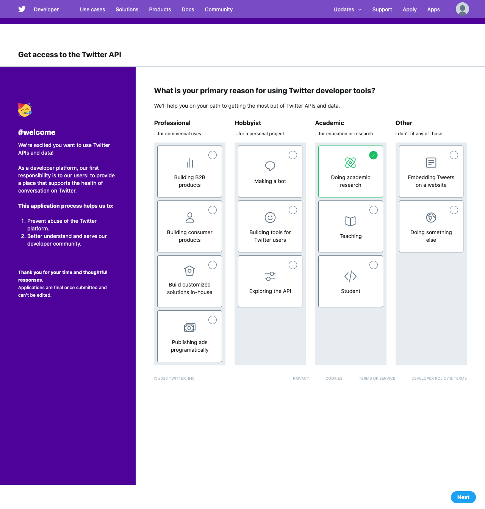
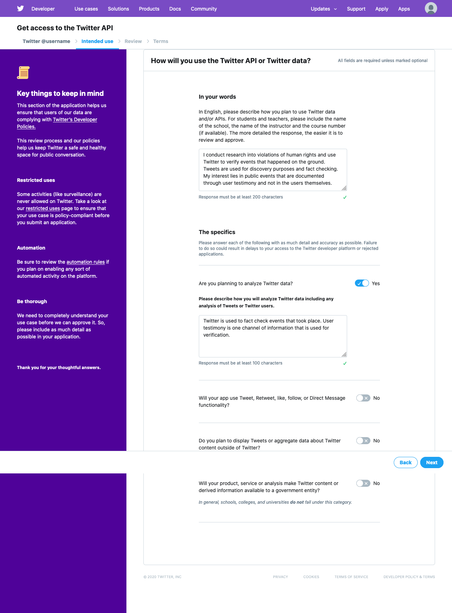
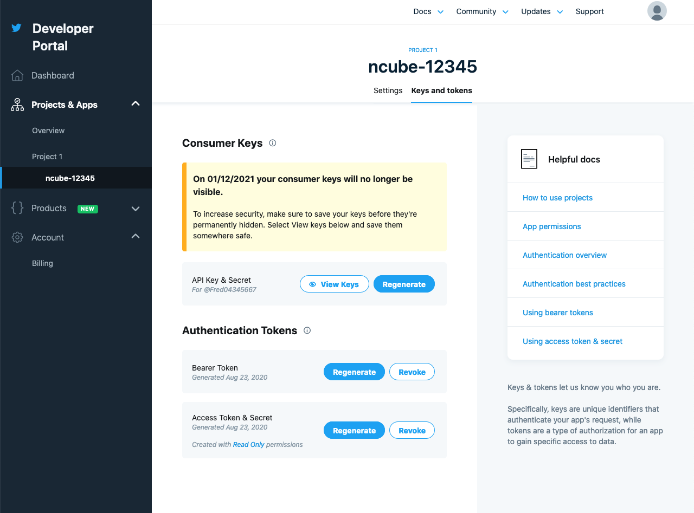

# How to get a Twitter API key

In order to begin using the Twitter API, you’ll need an account with Twitter that will get you access to an API Key.

First (if you haven’t done so),

## Create a Twitter user account

Head over to [Twitter.com](https://twitter.com/) and register for a free account.

## Head over to the Twitter Dev Site and apply for a developer account

Navigate to [developer.twitter.com](https://developer.twitter.com/) and sign in. In order to create an API key you have to signup for a developer account. Twitter requires to connect a phone number to your account. You can set up a phone number in the account settings of your Twitter account.

When creating a Twitter developer account you have to specify what you want to use the account for. Further down the process you have to describe your usage in more details. Twitter uses your answers to review your account and can decide to limit your access to the Twitter API if they deem necessary. In this case I selected to conduct academic research and described my intended usage of the Twitter API as doing research and fact checking. I further stated that I won't be publishing tweets or make it available to governement institutions. Once you finished the application you'll have to wait for Twitter to review your case and grant you access.

## Create a new application to get your API keys

Once you received a positive confirmation by Twitter you can go to the [Twitter apps](https://developer.twitter.com/en/apps) page and create a new application.

Browse to your project dashboard and under 'Projects & Apps' -> 'Project' click on `Keys and tokens`. You require the **API Key & Secret** and **Access Token & Secret** keys. The API key is called **consumer key** in Ncube and API key secret is called **consumer secret**. The name of the access toekns is the same.

Copy those keys and use them to setup Ncube.
