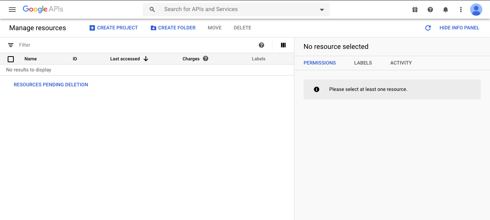
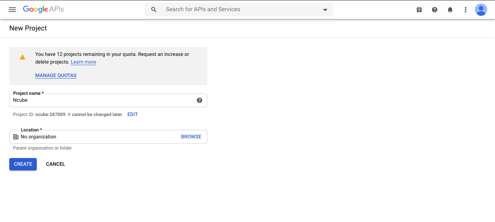
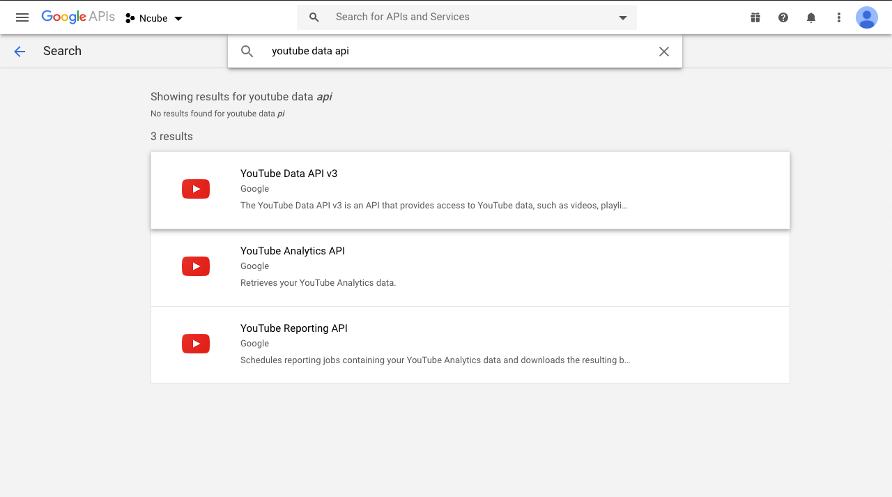
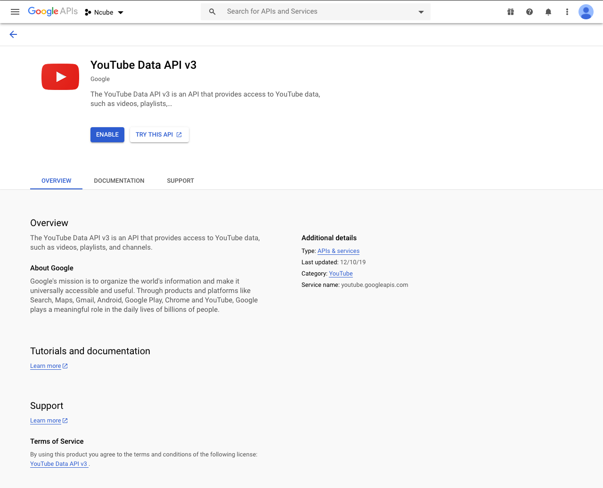
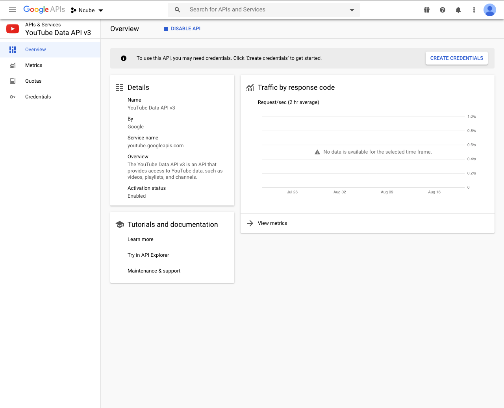
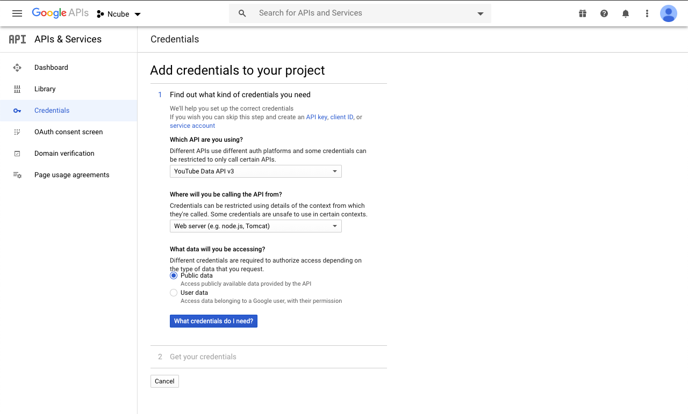
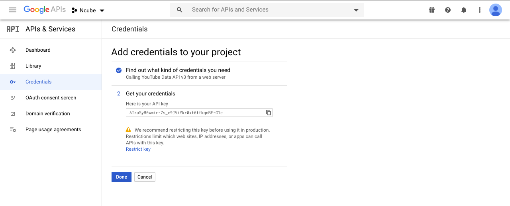

# How to get a Youtube API key

To generate a Youtube API key, you'll need to an account with Google.

First (if you haven't done so),

## Create a Youtube account

Go to the [Google developers page](https://developers.google.com/) and sign up for an account.

## Create your project

When you log in into your account, head over to the [developers console](https://console.developers.google.com/project) and _CREATE PROJECT_ by clicking on the blue button. Wait a few seconds for Google to prepare your project.

## Enable the Youtube API

On the top, click the _Enable API's and Services_ link and then follow the link option dubbed “YouTube DATA API” below the YouTube API’s icon. Now select the “ENABLE” button which manifests after you click the YouTube DATA API link.

## Create your credentials

Now click the blue button on the far right titled _Create Credentials_. On the first select option displayed on this page, choose the YouTube Data API v3, and then the Web server (such as node js. Tomcat) on the second option. For the third option, choose public data. Lastly, click the button with “what credentials do I need” and then move on to the next step. After hitting the “What credentials do I need” button, Google will create your new project, and you can now copy your API Key from this page.

## Costs of the Youtube API

YouTube Data API costs are based on [quota usage](https://developers.google.com/youtube/v3/getting-started), and all requests will incur at least a 1-point quota cost. For each project, you’re allowed 10,000 free quota units per day. You can use the [quota calculator](https://developers.google.com/youtube/v3/determine_quota_cost) to determine your quota costs. If you need more queries, you can apply for higher quotas, but pricing may vary.
