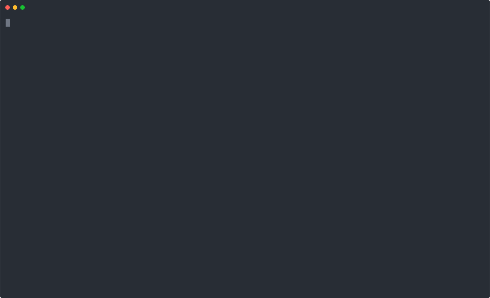

import Synopsis from "../../src/components/synopsis"
import Note from "../../src/components/note"

<Synopsis>
<li>This guide takes you from setup on your computer right through to the point that you are ready to run your first Sugarcube task.</li>
<li>Sugarcube runs wholly through your computer's Terminal. Since many Sugarcube users might not be familiar with the Terminal, some explanations of key commands have been included along the way.</li>
</Synopsis>

# Installing Sugarcube

Most people normally work with directories using the computer's graphical interface (i.e. folder icons, etc). But here you'll be working with directories through your computers "Terminal" - its Command Line interface (CLI). This is because Sugarcube in general runs through the CLI; working with folders is also a good way to start becoming familiar with it.

## Requirements

Sugarcube is developed in [NodeJS](https://https://nodejs.org). Currently version 10 and 12 are supported.

The following instructions are for Debian 10 (Buster). They should work on any Ubuntu as well.

```shell
curl -sL https://deb.nodesource.com/setup_10.x | sudo bash -
sudo apt install nodejs
```

<Note>
If you get an error that `curl` can't be found, you have to install it. On Debian this can be done using `apt install curl`.
</Note>

Check that both Node and NPM are there by typing the following commands into your Terminal:

Node:

```shell
node --version
```

Node Package Manager (NPM)

```shell
npm --version
```

You should see a result for each that looks something like this:



<Note>
The npm command must be at least version 6.9.0. If your version of npm is below that run <i>npm install -g npm</i> to upgrade.
</Note>

Some plugins run a browser in headless mode to browse websites. Sugarcube automatically sets the browser up but requires some dependencies preinstalled to make this work.

On Debian install `libxss1` and `libgconf-2-4`.

```shell
sudo apt install libxss1 libgconf-2-4
```

On Ubuntu install the `libxss1`, `libxcursor1` and `libgtk-3-0`.

```shell
sudo apt install libxss1 libxcursor1 libgtk-3-0
```

Sugarcube uses [Apache Tika](https://tika.apache.org/) to extract text and meta data from websites and documents. Sugarcube installs Tika, but in order to run it you need the JAVA Runtime. Tika can use [Tesseract OCR](https://github.com/tesseract-ocr/tesseract) to extract content from images. To enable Tika to do so install it as well. Tesseract supports many languages but each language requires an additional language pack to make use of it. Install any language pack that might be needed. The example below installs the language pack for German, English and Arabic.

```shell
sudo apt install default-jre tesseract-ocr tesseract-ocr-deu tesseract-ocr-ara tesseract-ocr-eng
```

The following command shows you all available language packs for Tesseract.

```shell
apt search tesseract-ocr
```

Great! Now you can install Sugarcube itself.

## Set up Sugarcube

The preferred way to start using Sugarcube, is to set up a specific directory (folder) on your computer to put everything Sugarcube-related into (the Sugarcube code as well as the data you'll be creating). This approach will be used throughout this documentation.

<Note>
Alternatively it's possible to install Sugarcube globally using the `-g` argument for `npm install`, or to use the <a href="https://www.npmjs.com/package/npx">`npx`</a> command, which is a tool to execute a npm package without having to install it first.
</Note>

Open your Terminal and create a Sugarcube test directory using the command 'mkdir' (short for 'make directory'). To create a subdirectory in your Home folder called `sugarcube-project` using `mkdir` and move into your project directory through the 'cd' (change directory) command by typing:

```shell
mkdir sugarcube-project
cd sugarcube-project
```

<br />


That means that **all commands you issue from now on will apply to the `sugarcube-project` folder**. If for whatever reason you need to get out of that directory, just type `cd` - this will return you to your parent Home directory.

Now that you've successfully used Terminal to first create a project folder and then to position yourself within it, you need to get things up and running.  You do this by initialising, or "kick-starting", NPM (Node Package Manager, which you intalled at the beginning).

```shell
npm init -y
```

This adds a file called `package.json` to your directory. This file contains code that will manage Sugarcube's versions and dependencies - i.e. it will make sure that you have the right versions of the software you need, and that it all works together smoothly.

Check that this file has been added to your `sugarcube-project` directory by using a simple "list" command, which you can use any time, on any folder (directory). Type `ls` to simply list the contents of that folder.

```shell
ls
```

<br />


You are almost done. The last thing that is left to do is to install Sugarcube itself.

```shell
npm install @sugarcube/sugarcube
```

Sugarcube is now installed and ready to go. You can test that all went well by printing the help page of Sugarcube.

```shell
$(npm bin)/sugarcube -h
```

<br />


<Note>
`npm` places the `sugarcube` application into the `node_modules/.bin` folder of your project directory. Using the `$(npm bin)/sugarcube` syntax makes sure to resolve to the correct path. Alternatively specify the path to the application manually: `./node_modules/bin/sugarcube`. See <a href="https://docs.npmjs.com/cli/bin.html">npm's documentation</a> for more information.
</Note>

## Optional Requirements

Some plugins have additional requirements. Unless those plugins are needed, there is no need to install those requirements:

- The `media_youtubedl` plugin uses [`youtube-dl`](https://ytdl-org.github.io/youtube-dl/index.html) to download videos from a variety of sources.
- The `media_mosaic` plugin uses [`ffmpeg`](https://www.ffmpeg.org/) to generate mosaic images from videos.


```shell
sudo apt install youtube-dl ffmpeg
```

In order to persist data at least one of the following databases are required. Sugarcube supports [MongoDB](https://www.mongodb.com/) and [Elasticsearch](https://www.elastic.co/products/elasticsearch). More information can be found in the [guide about data persistency](/sugarcube/databases).
